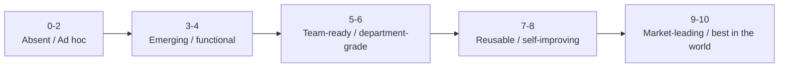

# Startup Intelligence OS Full Maturity Roadmap

**Date:** 2026-03-12  
**Scale:** `0 = absent`, `10 = best in the world`

## Objective
Create one operating roadmap that defines what `10/10` means across every core department, studio, feature layer, function, toolchain, protocol stack, and data surface inside Startup Intelligence OS.

## Current-State Visual

## Zero-to-Ten Definition By Layer

| Layer | Current | `10/10` means | Next point-lift |
|---|---:|---|---|
| Company genome | 4.1 | Every company, project, decision, run, artifact, and assumption has typed ownership, lifecycle, stage gates, and dependency links. | Make every active company/project visible in `.startup-os/workspace.yaml` and graph links. |
| Department registry | 4.0 | All core departments and studios have canonical missions, routing, handoffs, scorecards, memory paths, and reuse packs. | Finish the missing detail packs and connect them to console views. |
| Evidence graph | 3.9 | Every recommendation resolves to named source bundles, freshness stamps, confidence, and contradictions. | Finish corpus conversion and attach source bundles to more routed runs. |
| Operator console | 3.6 | Jake can see maturity, signals, blockers, corpus status, readiness, and next-best actions in one place. | Add explicit maturity and corpus widgets for all departments. |
| Memory and evaluation | 3.4 | Every run writes back examples, failure patterns, evaluation scores, and reuse candidates automatically. | Standardize writeback and rubric fields across all departments. |
| Trust and governance | 3.6 | Claims review, privacy boundaries, release gates, and evidence traceability are inherited everywhere. | Add policy and approval checks to training, scraping, and publish paths. |
| Data acquisition | 3.5 | Multi-tool scraping runs continuously across local, repo, and live web surfaces with manifests and retries. | Complete local extraction, then wire live crawl keys and refresh jobs. |
| Binary normalization | 2.7 | All high-value formats normalize to reusable markdown/text with recoverable failures. | Keep hardening Office/PDF extraction and add incremental checkpoints. |
| Persona and agent access | 3.1 | Every persona/agent receives the right context bundle by default and cannot operate blind on material asks. | Publish the access matrix and enforce required bundles in routed work. |
| Training factory | 2.9 | Training assets are generated, critiqued, scored, and improved as a reusable system. | Build facilitator packets, rubrics, and named examples for all eight sessions. |

## Full Department Roadmap

| Department | Current | `10/10` department state | Next point-lift |
|---|---:|---|---|
| Founder Decision Room | 4.4 | Every strategic or architectural move is framed, optioned, risk-scored, routed, and closed with outcomes. | Enforce decision-linking for more material asks. |
| Consumer User Studio | 4.0 | User signal becomes ranked opportunities, validated assumptions, journey insights, and experiment plans continuously. | Expand direct evidence ingestion and recurring synthesis. |
| Product & Experience Studio | 4.2 | The studio moves from problem framing to workflow design, critique, implementation packet, and instrumentation with minimal drift. | Connect more concept critique and delivery handoff artifacts. |
| Marketing & Narrative Studio | 3.8 | One research spine generates decks, memos, message maps, handouts, and campaign assets with proof discipline. | Formalize asset cascades and proof requirements per request type. |
| Engineering & Agent Systems Studio | 4.0 | The OS, Susan runtime, console, pipelines, and eval systems evolve safely with tests, monitoring, and reusable architecture packs. | Add corpus/eval monitoring and more graph-backed operator views. |
| Job Studio | 3.3 | Job Studio runs as a reusable training, memory, opportunity, and personal operator department with giant corpora and strong evaluation. | Finish Track C/B packets, corpus conversion, and access protocols. |
| Data & Decision Science Studio | 3.8 | Raw events, evidence, experiments, and evaluation data turn into scorecards, forecasts, and decision simulations. | Add scorecard definitions and forecast-ready metrics. |
| Revenue & Growth Studio | 3.2 | ICP, offer, proof, pipeline, conversion, and learning loops run as one measurable engine. | Define canonical growth motions, metrics, and artifact templates. |
| Finance & Operating Cadence Studio | 3.0 | KPI trees, planning cycles, resource allocation, and operating reviews are always current and decision-linked. | Create cadence packets and variance response workflows. |
| Talent & Org Design Studio | 2.6 | Capability gaps translate into org design, roles, hiring loops, onboarding, and readiness tracking. | Stand up the role scorecard and hiring packet stack. |
| Trust & Governance Studio | 3.6 | Security, policy, claims review, accessibility, and release gates are built into every department workflow. | Ship explicit trust gates for scraping, publish, and training delivery. |

## Feature, Function, and Toolchain Maturity Targets

| Surface | Current | `10/10` means |
|---|---:|---|
| Routing and action packets | 4.1 | Every ask produces a sequenced, evidence-aware action packet with decision requirements and context bundles. |
| Department packs | 4.0 | Every department pack contains mission, owner, intake schema, diagnosis protocol, outputs, scorecard, writeback, and handoffs. |
| Signals | 3.4 | Tests, stale evidence, blocked gates, and corpus drift all surface as operator-visible signals automatically. |
| Graph links | 3.5 | Companies, departments, capabilities, projects, artifacts, runs, and assumptions are linked and queryable. |
| Skill packs | 3.7 | Codex and Susan both expose reusable skill packs for training, research, evaluation, and orchestration. |
| Corpus locators | 4.0 | Every corpus has a maintained locator, path map, freshness stamp, and intended use. |
| Live crawl manifests | 3.2 | Public web sources are declared in manifests with tool choice, depth, priority, and refresh cadence. |
| Repo harvests | 4.1 | Key repos are mirrored, normalized, and tagged into reusable operating examples. |
| Deck/handout generation | 2.8 | Training assets can be assembled programmatically from named examples and templates. |
| Evaluation panel | 2.5 | Transcript review, output scoring, and facilitator feedback drive future asset quality. |

## Two-Year 10x Trajectory

### Wave 0: Now to 30 days
- Finish zero-to-ten definitions and current-state visuals for every department and operating layer.
- Complete Job Studio training factory structure, agent access protocol, and first corpus pass.
- Convert the highest-value Oracle and local repo materials into named training examples.

### Wave 1: 30 to 90 days
- Lift every department to at least `4/10` with one repeatable workflow and explicit scorecard.
- Move Job Studio to `5/10` by completing all eight session packets and an evaluation loop.
- Turn corpus extraction into a measured, resumable program with failure visibility and ingest checkpoints.

### Wave 2: 3 to 12 months
- Bring departments to `6-7/10` through weekly cadences, dashboard visibility, memory writeback, and operator-grade scorecards.
- Reuse training, memory, and evaluation systems across multiple companies.
- Add live refresh and contradiction detection to the evidence graph.

### Wave 3: 12 to 24 months
- Reach `8-10/10` on the shared OS layers: graph, operator console, evidence, routing, and evaluation.
- Reach `7-9/10` on all departments, with Job Studio functioning as a reference training and operator department.
- Establish category-defining performance in ask-to-output speed, grounding, reuse, and measurable learning.

## Build Rule
No department, feature, function, or tool can claim `10/10` until it has:
- explicit protocols
- attached evidence and source bundles
- clear ownership
- evaluation loops
- visible current-state score
- reusable outputs
- writeback and refresh behavior
