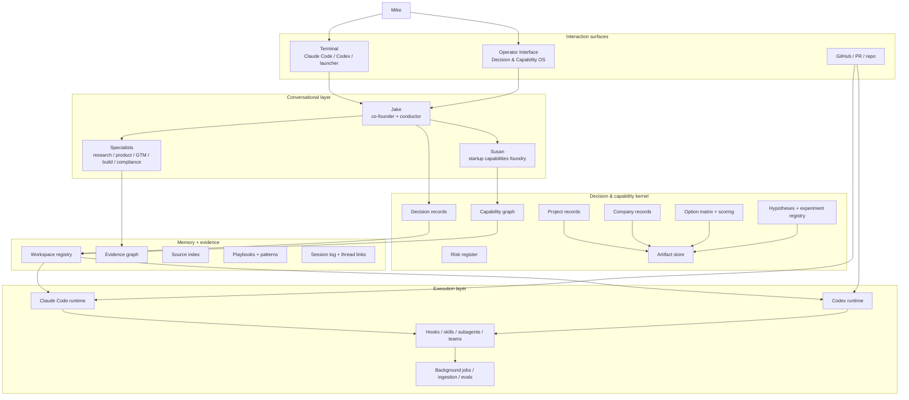
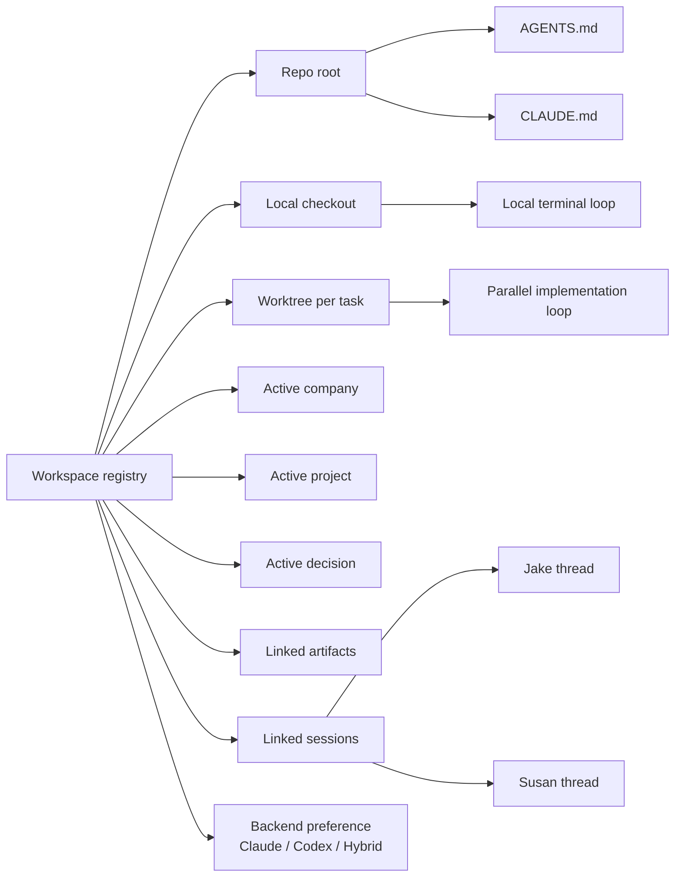
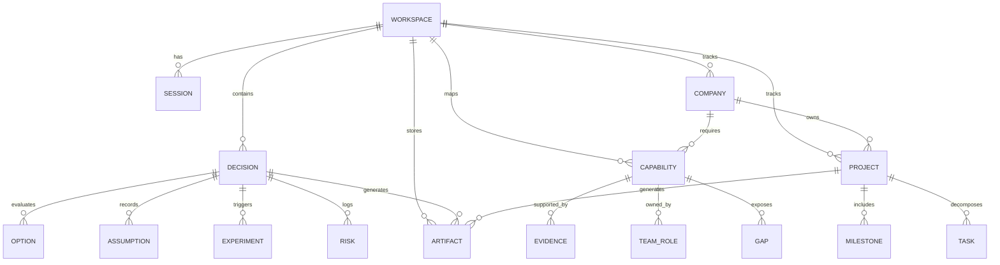
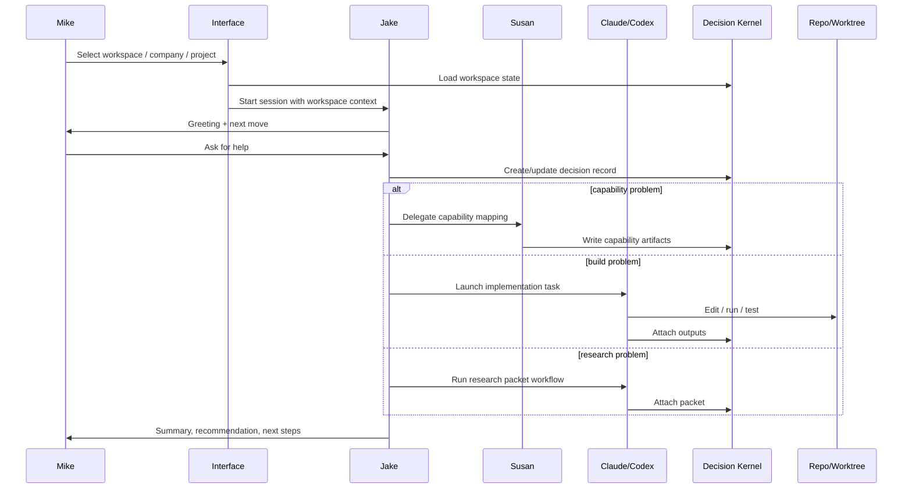

# Decision & Capability OS — Aggressive Plan

## 1. Positioning

This is no longer “startup intelligence” as a broad research hub.

This is a **Decision & Capability OS** for building:
- new companies
- new projects
- new capability systems
- repeatable operating models
- agent + human teams

The OS must help answer five recurring questions:

1. What should we build?
2. Why this path and not the alternatives?
3. What capabilities are missing?
4. Who or what should do the work?
5. What did we learn that changes the next decision?

---

## 2. The hard recommendation

Keep **Jake** and **Susan** as the human-facing layer.

Do **not** make them the real system.

They should sit on top of:
- a decision kernel,
- a capability kernel,
- a workspace registry,
- an artifact system,
- a memory graph,
- a routing layer for Claude Code, Codex, and any future runtime.

That is the only way to preserve the part you care about — a real co-founder style interface — without turning the repo into a persona maze.

---

## 3. Product definition

> **Decision & Capability OS** is a workspace-native operating system for building companies and projects. It converts ambiguous goals into decision records, capability maps, team plans, research packets, execution plans, experiments, and reusable playbooks.

### Primary jobs
- build a company from an idea or problem space
- build a project from intent to execution
- diagnose capability gaps
- design agent + human teams
- turn conversations into artifacts and action
- keep terminal work and interface work in sync

---

## 4. The target system

---

## 5. The non-negotiable architecture choice

### The terminal is the write surface
That is where:
- you talk to Jake
- repos are open
- commands run
- branches move
- work gets done

### The interface is the control plane
That is where:
- you choose workspace
- you choose company or project
- you inspect decisions
- you review capability gaps
- you browse artifacts
- you trigger workflows
- you hand off between local, worktree, and cloud

If you collapse those into one surface, you will either:
- lose execution speed, or
- lose operational clarity.

---

## 6. The main design problem you asked about

### Problem
You want:
- Claude Code or Codex in the terminal
- a new interface
- named conversational agents
- the same work to stay coherent across all of it

### The real issue
The issue is **not** “which UI should I use?”

The issue is **state ownership**.

If both the terminal and the interface think they own:
- the working directory,
- the active branch,
- the active thread,
- the active company / project,
- the current task,

you get context drift, branch collisions, duplicated memory, and broken trust.

### Solution
Create a **workspace contract**.

A workspace becomes the unit of identity across every surface.

Each workspace has:
- `workspace_id`
- `repo_root`
- `worktree_path`
- `active_backend`
- `active_company`
- `active_project`
- `active_decision`
- `session_ids`
- `artifact_paths`
- `branch_name`
- `status`

The interface never “edits the repo in the abstract.”
It always targets a workspace.

The terminal never “floats.”
It always opens inside a workspace.

---

## 7. Workspace model

### Rule set
1. One **workspace** per active company / project context.
2. One **worktree** per major task or thread that edits code.
3. The **interface** selects and displays workspaces.
4. The **launcher** opens the correct backend in the correct workspace.
5. The **decision kernel** stores artifacts independent of chat history.
6. **Jake** is the default front door for every workspace.
7. **Susan** is a specialist, not the top-level router.

---

## 8. Agent system design

## Jake
**Role:** co-founder, conductor, architect, strategist, decomposer

### Jake should do
- greet you at session start
- identify whether you are building a company, project, capability, or fixing execution drift
- create or update a decision record
- decide whether Susan or a specialist should be invoked
- keep the conversation practical
- end every major turn with next moves

### Jake should not do
- become the storage layer
- become the only agent
- replace scoring, schemas, and artifacts
- freestyle without creating records

## Susan
**Role:** startup capabilities foundry

### Susan should do
- map current vs target capabilities
- identify missing human and agent roles
- specify capability definitions
- design operating rhythms
- define world-class bars
- generate capability build plans

### Susan should not do
- become the lead every time
- own all decisions
- replace Jake
- replace research protocols

## Specialist pack
Aggressive plan starter set:
- researcher-methods
- researcher-market
- researcher-customer
- product-architect
- experiment-designer
- execution-planner
- risk-compliance
- builder-operator

But do not expose all of them at once in the UI.
Expose:
- Jake
- Susan
- Research
- Build

Keep the rest as internal delegates until trust is earned.

---

## 9. Capability gaps to close

## A. Decision system gaps
| Gap | What exists | What must be built |
|---|---|---|
| Decision ledger | ad hoc docs and reports | first-class decision object |
| Option scoring | loose analysis | structured scoring model |
| Assumptions ledger | implied assumptions | explicit assumption records |
| Reversal criteria | rarely recorded | “what would change our mind” field |
| Decision lineage | fragmented | parent/child decision graph |
| Decision status | informal | draft / review / approved / superseded |

## B. Capability system gaps
| Gap | What exists | What must be built |
|---|---|---|
| Capability ontology | partial language | formal capability taxonomy |
| Current vs target state | narrative | scorecard + maturity model |
| Capability owner | implicit | owner field per capability |
| Build path | generic plan | capability roadmap |
| Human vs agent split | persona list | explicit allocation rules |
| Evidence basis | mixed | linked evidence per capability |

## C. Research system gaps
| Gap | What exists | What must be built |
|---|---|---|
| Research methods registry | scattered | methods library |
| Source quality ranking | inconsistent | source grading |
| Protocol templates | partial | protocol pack |
| Definitions | fuzzy | canonical definitions |
| Benchmarks | ad hoc | target benchmark library |
| Eval loop | weak | skill + workflow evals |

## D. Execution gaps
| Gap | What exists | What must be built |
|---|---|---|
| Project decomposition | strong instinct | reusable backlog generator |
| Branch / worktree model | partial | workspace/worktree router |
| Artifact routing | markdown files | artifact index + explorer |
| Company/project lifecycle | implicit | explicit stage model |
| Run status | limited | workflow run timeline |
| Handoff | manual | terminal ↔ interface handoff |

## E. Interface gaps
| Gap | What exists | What must be built |
|---|---|---|
| Workspace picker | none | workspace home |
| Decision room | none | decision board |
| Capability foundry | none | capability map UI |
| Artifact explorer | file system only | indexed artifact browser |
| Team console | chat only | named team panel |
| Session continuity | weak | thread + artifact linking |

---

## 10. Product modules

### Module 1 — Workspace Home
The root object. Everything hangs off this.

**Shows**
- active company / project
- active repo / worktree
- backend mode
- active branch
- recent decisions
- recent artifacts
- team status

### Module 2 — Company Builder
Used to create and evolve a company record.

**Outputs**
- company brief
- market frame
- problem frame
- target customer
- capability gaps
- company roadmap

### Module 3 — Project Builder
Used for actual project execution.

**Outputs**
- project brief
- scope
- milestones
- decision log
- execution board
- risk log

### Module 4 — Decision Room
The real core.

**Outputs**
- decision record
- alternatives
- option scoring
- assumptions
- recommendation
- reversal criteria
- linked experiments

### Module 5 — Capability Foundry
Susan’s home.

**Outputs**
- current-state capability map
- target-state capability map
- maturity levels
- missing capabilities
- human/agent team design
- build sequence

### Module 6 — Research Packet
Deep work on definitions, methods, benchmarks, and protocols.

**Outputs**
- research plan
- method notes
- source stack
- benchmark targets
- protocol recommendations
- synthesis memo

### Module 7 — Artifact Explorer
Search, inspect, compare, and reuse.

### Module 8 — Team Console
Shows:
- Jake
- Susan
- specialists
- task routing
- active jobs
- thread handoffs

---

## 11. Data model

### First-class objects
- workspace
- company
- project
- decision
- option
- assumption
- capability
- gap
- artifact
- experiment
- risk
- session
- team role

---

## 12. The dual-runtime model

### Claude Code is best for
- named teammates
- subagents
- agent teams
- hooks
- plugins
- project memory
- terminal-native collaboration

### Codex is best for
- repo-guided build execution
- AGENTS-driven engineering discipline
- worktree-heavy parallel work
- cloud delegation
- GitHub review
- structured skills and evals

### The aggressive design
Use **hybrid routing**.

- Default conversational front door: **Claude Code**
- Default execution / implementation engine: **Codex**
- Shared artifacts and workspace contract sit above both

That gives you:
- the co-founder feel you want
- the terminal control you want
- the engineering discipline you need

---

## 13. How the user experience should feel

### At session start
Jake greets you:
- confirms workspace
- confirms active company / project
- confirms active decision
- suggests next highest-leverage move

### During work
Jake routes:
- “this is a capability problem → Susan”
- “this needs research → Research packet”
- “this is a build task → Codex or builder”
- “this needs a company frame → Company Builder”

### After work
The OS writes:
- decision record
- artifact
- next actions
- updated status
- linked session notes

This is the difference between “chat” and “OS.”

---

## 14. How to guarantee Jake shows up every time

You asked for Jake to greet you each interaction.

### Best-practice answer
Do not rely on pure prompt compliance for this.

Use three layers:
1. **Instruction layer**
   - `CLAUDE.md` and `AGENTS.md` say Jake is the front door.
2. **Launcher layer**
   - a `jake` script prints the greeting and launches Claude or Codex in the right workspace.
3. **Interface layer**
   - the UI renders Jake as the default active teammate.

That way:
- if the model follows instructions, great
- if it drifts, the launcher and UI still preserve the experience

---

## 15. Operating flow

---

## 16. Build sequence

## Phase 0 — Stop the chaos
- define workspace contract
- define first-class objects
- define artifact paths
- define launcher and repo conventions

## Phase 1 — Jake front door
- build Jake launcher
- create root instructions
- create company/project context files
- create workspace selector
- create interface home

## Phase 2 — Susan capability foundry
- capability ontology
- current vs target scoring
- gap maps
- team design outputs
- capability roadmaps

## Phase 3 — Decision room
- decision records
- option scoring
- assumptions
- reversal criteria
- risk register
- experiment links

## Phase 4 — Research system
- research packet workflow
- definitions library
- source quality rules
- protocols and benchmarks
- eval-backed research skills

## Phase 5 — Build execution
- Codex worktree routing
- PR workflow
- review workflow
- run artifacts into interface
- status and timeline

## Phase 6 — Team system
- internal specialists
- exposed team console
- routing rules
- background jobs
- audit / governance

---

## 17. What to expose in v1 vs hide

### Expose in v1
- Jake
- Susan
- Research
- Build
- Workspace Home
- Decision Room
- Capability Foundry
- Artifact Explorer

### Hide in v1
- too many named experts
- simulation theater
- portfolio dashboards
- broad automation panels
- too much model/provider choice
- complex graph views nobody will trust yet

---

## 18. Success metrics

### Product metrics
- time from ambiguous ask to decision record
- time from decision to artifact
- number of company / project workflows completed
- % of decisions with 3+ options
- % of decisions with reversal criteria
- % of capabilities scored current + target
- artifact reuse rate
- terminal-to-interface handoff success

### Experience metrics
- Jake greeting appears in new sessions
- workspace context loaded correctly
- no wrong-repo edits
- no branch collisions
- no orphan artifacts
- low user need to restate context

---

## 19. Bottom line

Your real product is:

- not a resource hub
- not just Susan
- not just Jake
- not just a terminal wrapper
- not just a dashboard

It is a **Decision & Capability OS** with:
- Jake as front door
- Susan as capability foundry
- terminal as cockpit
- interface as command center
- workspace as unit of execution
- decisions and capabilities as first-class state
- Claude and Codex as swappable runtimes

That is how you keep the system human, conversational, and operational at the same time.
