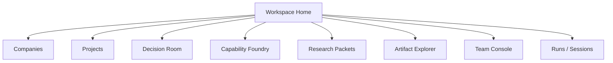
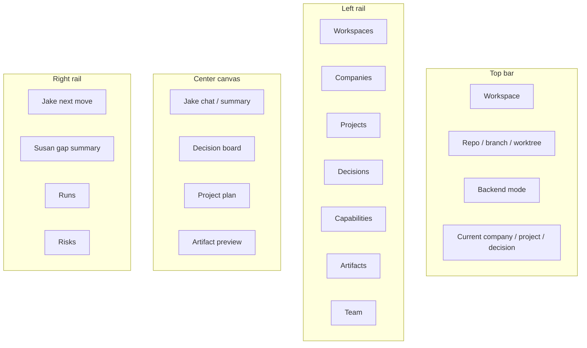

# Decision & Capability OS — Interface Spec

## Product goal

Build an interface that makes terminal-based company and project building coherent, visible, and easier to route — without replacing the terminal.

---

## 1. Information architecture

---

## 2. Navigation model

### Left rail
- Workspaces
- Companies
- Projects
- Decisions
- Capabilities
- Research
- Artifacts
- Team
- Runs

### Top bar
- active workspace
- active backend
- active repo / branch / worktree
- current company
- current project
- current decision
- quick actions

### Center canvas
Context-dependent page

### Right rail
- Jake summary
- Susan summary
- next actions
- linked artifacts
- risks / blockers

---

## 3. Core screens

## A. Workspace Home
### Purpose
Single place to orient yourself.

### Must show
- workspace name
- repo root
- backend mode
- active branch / worktree
- current company
- current project
- current decision
- open runs
- recent artifacts
- Jake’s recommended next move

### Primary actions
- open terminal in workspace
- resume Jake session
- open Susan
- start decision workflow
- start capability audit
- create project
- create company

---

## B. Company Builder
### Purpose
Turn a company concept into a structured operating object.

### Sections
- company brief
- problem and customer
- market context
- wedge
- business model
- capability gaps
- options and strategic paths

### Outputs
- company record
- company brief
- company roadmap
- company capability map
- linked decisions

---

## C. Project Builder
### Purpose
Take a concrete initiative from ask to plan.

### Sections
- project brief
- scope
- deliverables
- milestones
- dependencies
- decisions
- tasks
- linked artifacts

### Outputs
- project record
- milestone plan
- delivery backlog
- active worktree link

---

## D. Decision Room
### Purpose
This is the core workflow page.

### Layout
- left: decision context and evidence
- center: options matrix
- right: recommendation and next actions

### Fields
- problem statement
- constraints
- alternatives
- option scores
- assumptions
- risks
- recommendation
- reversal criteria
- linked experiments

### Actions
- create decision
- compare options
- send to research
- send to build
- promote to roadmap
- mark superseded

---

## E. Capability Foundry
### Purpose
Susan’s home.

### Layout
- current-state capability map
- target-state capability map
- maturity delta
- missing capabilities
- human / agent ownership
- build sequence

### Actions
- audit capability set
- design target team
- propose new capability
- link evidence
- create capability roadmap

---

## F. Research Packet
### Purpose
Deep work on definitions, methods, targets, and protocols.

### Layout
- question
- method
- source stack
- definitions
- benchmarks
- synthesis
- recommended protocol

### Actions
- start packet
- refine question
- add source pack
- compare definitions
- save as playbook

---

## G. Artifact Explorer
### Purpose
Make outputs reusable.

### Artifact types
- briefs
- PRDs
- decision records
- research packets
- capability maps
- roadmaps
- execution plans
- risk logs

### Must support
- search
- filters
- compare
- link to workspace / company / project / decision
- open source path

---

## H. Team Console
### Purpose
A visible team, not an invisible tangle.

### Exposed teammates
- Jake
- Susan
- Research
- Build

### Internal-only teammates
- risk
- product
- GTM
- experimentation
- compliance
- execution

### Actions
- switch speaker
- route work
- see active jobs
- inspect current thread
- hand off to terminal

---

## I. Runs / Sessions
### Purpose
Track actual execution.

### Shows
- who ran
- where it ran
- workspace
- backend
- worktree
- start / stop time
- outputs
- status
- linked artifacts

---

## 4. Key interaction patterns

## Pattern 1 — Terminal handoff
User selects “Open in terminal”.
System opens the correct workspace/worktree and backend.

## Pattern 2 — Build delegation
User clicks “Send to build”.
System creates a build task, links the decision, and opens or queues a Codex task.

## Pattern 3 — Research escalation
User clicks “Expand with research”.
System generates a research packet draft and routes to the research workflow.

## Pattern 4 — Capability audit
User clicks “Run Susan”.
System opens or routes to Susan with the active workspace context.

---

## 5. Minimum viable front-end

### Build v1 as
- React / Next.js
- local-first state cache
- API-backed workspace records
- markdown artifact renderer
- diff / file path links
- simple status timeline

### Do not build first
- fancy graph visualization
- simulation studio
- agent animation theater
- deep dashboarding
- too much realtime infrastructure

---

## 6. Home screen wireframe

---

## 7. UX rules

1. Jake is selected by default.
2. The workspace must always be visible.
3. The active branch or worktree must always be visible.
4. Every major screen must link back to the active decision.
5. Every artifact must show where it came from.
6. Every route-to-build action must create a linked run record.
7. The user should never have to guess which repo or thread is active.

---

## 8. Command palette

### Must support
- open workspace
- switch backend
- resume Jake
- open Susan
- create decision
- run capability audit
- send to build
- send to research
- open terminal
- create worktree
- open artifact

---

## 9. Bottom line

This interface is successful if it makes the terminal feel more powerful and less chaotic.

It fails if it becomes a second-class place to chat without owning state, routing, artifacts, and handoffs.
