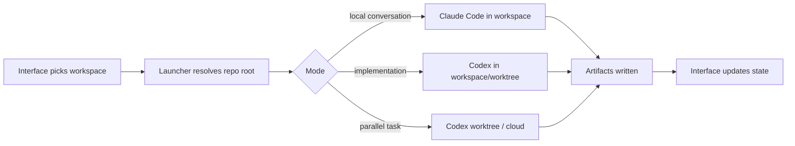

# Decision & Capability OS — Operating Model

## The shortest explanation

You keep building in the terminal.

The new interface does not replace the terminal. It makes the terminal coherent across:
- companies
- projects
- decisions
- artifacts
- agents
- sessions
- worktrees

The terminal is where you **do** the work.
The interface is where you **see, route, and manage** the work.

---

## 1. The operating system in one sentence

> You talk to Jake in the terminal, Jake routes work to Susan or specialists, the runtime does the task in the current workspace, and the interface keeps decisions, capabilities, artifacts, and sessions organized.

---

## 2. The surfaces

## A. Terminal
This is your main execution surface.

### Why you keep it
- fastest way to build
- easiest way to inspect code
- natural fit for repo work
- best for command execution and testing
- least overhead

### What happens here
- Jake greets you
- you ask for a company/project build task
- Jake decomposes it
- Claude Code or Codex runs the work
- artifacts are produced
- status gets updated

## B. Interface
This is not “another chat app.”

### It is for
- workspace selection
- context management
- artifact visibility
- decision tracking
- capability mapping
- handoffs
- run history
- routing to terminal / worktree / cloud

### It is not for
- replacing shell commands
- replacing git
- replacing direct code inspection
- replacing your flow

---

## 3. The roles

## Jake
Jake should feel like your co-founder in the room.

### Default behavior
- greets at the start of a new session
- confirms what you are building
- frames the problem
- suggests 2–3 paths
- picks who should help
- makes sure the output becomes structured artifacts

### Jake is the front door
Every session starts with Jake unless you explicitly open another agent.

## Susan
Susan is not the general chat surface.

She is the **capability foundry**.

### Susan is invoked when
- you need capability gaps mapped
- you need an operating model designed
- you need human + agent team design
- you need target definitions and maturity levels
- you need a capability roadmap

---

## 4. The runtime split

## Claude Code
Use for:
- conversational co-founder feel
- teammates
- named agents
- project memory
- session hooks
- internal collaboration

## Codex
Use for:
- disciplined implementation
- strong repo-guided execution
- parallel worktrees
- background cloud tasks
- review loops
- pull request workflows

## Recommended hybrid model
- **Jake-facing terminal:** Claude Code
- **Heavy implementation thread:** Codex
- **Review / cloud parallelism:** Codex
- **Multi-teammate conversational sessions:** Claude Code

---

## 5. The working directory problem

This is the actual thing you were pointing at.

### Why it breaks
Claude Code and Codex both anchor context to where you launch them.

If you open them in the wrong place:
- they load the wrong project guidance
- they edit the wrong files
- they miss the right instructions
- they lose the right company/project context

### The fix
Never launch either one “raw.”

Always launch through a workspace-aware wrapper.

---

## 6. The workspace contract

Each active context gets a workspace file.

Example:

```yaml
workspace_id: transformfit-core
repo_root: /Users/mike/companies/transformfit
default_backend: claude
active_company: TransformFit
active_project: motion-ui
active_decision: motion-ui-v1
active_branch: main
artifacts_root: .startup-os/artifacts
notes:
  - Jake is the front door for this workspace
  - Susan is the capability foundry
```

This workspace file is the bridge between:
- terminal
- interface
- Claude Code
- Codex
- local checkout
- worktree
- artifacts

---

## 7. The handoff model



### Rule
The UI never chooses files.
The UI chooses the workspace.
The runtime chooses the files.

That is the clean separation.

---

## 8. Recommended repo additions

At repo root:
- `AGENTS.md`
- `CLAUDE.md`
- `.startup-os/workspace.yaml`
- `.startup-os/companies/`
- `.startup-os/projects/`
- `.startup-os/decisions/`
- `.startup-os/capabilities/`
- `.startup-os/artifacts/`
- `.startup-os/sessions/`

This gives you a repo-native operating system instead of a chat-native one.

---

## 9. Session behavior

## Session start
Jake should:
1. greet you
2. load workspace context
3. confirm active company/project
4. suggest the highest-leverage next move

## During session
Jake should:
1. classify the request
2. update or create decision state
3. invoke Susan or specialists when needed
4. choose runtime path:
   - conversation only
   - research
   - build
   - review

## Session end
The system should:
1. write summary
2. link artifacts
3. update status
4. leave the next action obvious

---

## 10. How to make Jake greet you every time

You want this to feel consistent.

### Use three layers

## Layer 1 — Instructions
In `CLAUDE.md` and `AGENTS.md`:
- Jake is the default surface
- on the first reply of a new session, greet as Jake
- reference active workspace / project / decision

## Layer 2 — Launcher
Use `bin/jake`.

The launcher:
- prints Jake greeting
- resolves workspace
- picks backend
- opens Claude or Codex in the correct directory

This is the hard guarantee.

## Layer 3 — Interface default
The interface should always open with:
- Jake selected
- workspace summary visible
- next decision and next artifact visible

This gives continuity even if model behavior varies a bit.

---

## 11. Recommended user flows

## Flow A — Build a new company
1. Open workspace
2. Jake greets and confirms the company context
3. `/company-builder` or equivalent workflow runs
4. Jake routes Susan for capability mapping
5. Research packet fills market / methods / targets
6. Decision room creates company choices and recommendation
7. Interface shows artifacts and next actions

## Flow B — Build a new project
1. Open workspace
2. Jake clarifies scope
3. Project builder creates scope + milestones
4. Decision room creates option set
5. Codex gets implementation work in a worktree
6. Interface shows progress and artifacts

## Flow C — Fix a stuck project
1. Jake frames the stuck point
2. Decision room creates decision record
3. Susan maps missing capabilities
4. Research packet deepens the weak areas
5. Build thread executes the next move

---

## 12. The actual runtime recommendation

If you want the richest “team of people” feel in the terminal, start with **Claude Code** as the conversational shell.

If you want the strongest build discipline and parallel worktree flow, use **Codex** for implementation and review.

So the operating model is:

- **Jake shell:** Claude Code
- **Susan shell:** Claude Code subagent / specialist
- **Build executor:** Codex
- **Worktree parallelism:** Codex
- **Repo review:** Codex
- **Capability / decision memory:** OS layer, not chat history

---

## 13. What the interface should do for you every day

At minimum, the interface should answer:
- What workspace am I in?
- What company am I building?
- What project is active?
- What is the current decision?
- What capabilities are missing?
- What artifacts already exist?
- What is Jake recommending next?
- What is Susan recommending next?
- Which terminal / worktree / thread is doing work right now?

If it cannot answer those, the interface is ornamental.

---

## 14. Bottom line

You do not need to choose between:
- terminal
- conversational agents
- interface
- Codex
- Claude Code

You need a cleaner control model:

- workspace owns state
- terminal owns execution
- interface owns visibility
- Jake owns the front door
- Susan owns capability design
- runtimes are interchangeable underneath
